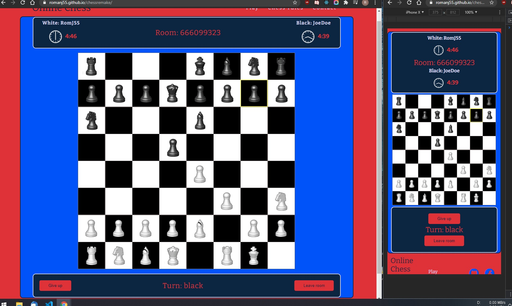

# Remake of my old Online chess game: https://github.com/RomanJ55/ReactChess
---

# Online Chess Game with React as the frontend and Python in the backend

- Backend repo: https://github.com/RomanJ55/backend (hosted on heroku)

---

# Fully functional chess game following the standard chess rules: https://en.wikipedia.org/wiki/Rules_of_chess

---

# Check it out here: https://romanj55.github.io/chessremake/

---
Game running:

